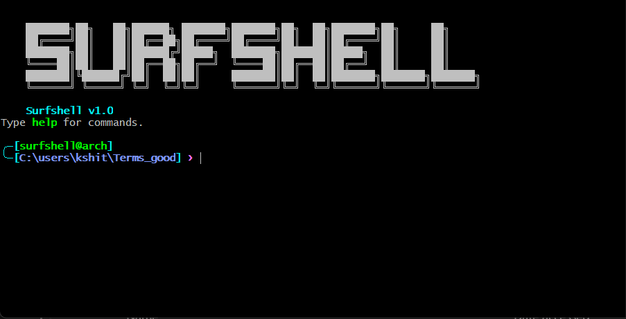

# 🌊 SurfShell

> A modern C++ terminal emulator inspired by Linux shells, featuring custom command implementations, an extensible architecture, and integrated web search capabilities.

SurfShell is a lightweight terminal emulator built entirely in **C++** that recreates the experience of a Unix-like shell while running on Windows. Rather than relying on existing shell utilities, SurfShell implements its own versions of commonly used terminal commands, making it an excellent project for learning operating systems, file systems, command parsing, and software architecture.

---
---

## 📸 SurfShell Terminal

<p align="center">
  
</p>

*SurfShell running with its custom terminal interface.*

---
## ✨ Features

* 🚀 Custom implementation of Linux-inspired shell commands
* 📁 File and directory management utilities
* 🔍 Built-in file searching and text searching
* 🌐 Integrated web search directly from the terminal
* 🎨 Custom terminal prompt and interface
* 📜 Command history support
* 🖥️ Neofetch-inspired system information command
* 🧩 Modular command parser and dispatcher architecture
* ⚡ Built using modern C++ for performance and extensibility

---

## 📂 Project Structure

```text
SurfShell/
│
├── main.cpp
├── commands.cpp
├── commands.h
├── commands_parser.cpp
├── commands_parser.h
├── commands_dispatcher.cpp
├── commands_dispatcher.h
├── terminal.exe
```

---

## 🛠️ Implemented Commands

| Command    | Description                            |
| ---------- | -------------------------------------- |
| `ls`       | List directory contents                |
| `cd`       | Change current directory               |
| `pwd`      | Print working directory                |
| `mkdir`    | Create directories                     |
| `touch`    | Create empty files                     |
| `rm`       | Remove files                           |
| `cp`       | Copy files                             |
| `mv`       | Move or rename files                   |
| `cat`      | Display file contents                  |
| `head`     | Show the first lines of a file         |
| `tail`     | Show the last lines of a file          |
| `diff`     | Compare two files                      |
| `grep`     | Search text patterns                   |
| `find`     | Search files and directories           |
| `tree`     | Display directory hierarchy            |
| `history`  | Show previously executed commands      |
| `clear`    | Clear the terminal screen              |
| `help`     | Display available commands             |
| `echo`     | Print text to the terminal             |
| `stat`     | Display file information               |
| `wc`       | Count lines, words, and characters     |
| `search`   | Perform web searches from the terminal |
| `neofetch` | Display system information             |

---


## 🏗️ Architecture

SurfShell follows a modular architecture to simplify maintenance and future expansion.

```
User Input
     │
     ▼
Command Parser
     │
     ▼
Command Dispatcher
     │
     ▼
Command Implementation
     │
     ▼
Operating System / File System
```

This separation allows new commands to be added with minimal changes to the existing codebase.

---

## 🚀 Getting Started

### Prerequisites

* C++20 compatible compiler
* MSYS2 / MinGW
* Git

### Clone the Repository

```bash
git clone https://github.com/Herostomo/SurfShell.git
cd SurfShell
```

### Build

```bash
g++ -std=c++20 -Wall -Wextra -g main.cpp commands.cpp commands_parser.cpp commands_dispatcher.cpp -o terminal.exe -lcurl
```

### Run

```bash
./terminal.exe
```

---

## 📖 Documentation

Complete technical documentation is available in the dedicated documentation repository:

**📚 https://github.com/Herostomo/SurfShell-Documentation**

The documentation includes:

* Architecture overview
* Command implementation details
* Algorithms
* Command syntax
* Usage examples
* Internal design documentation

---

## 🤝 Contributing

Contributions are welcome!

If you'd like to improve SurfShell:

1. Fork the repository.
2. Create a new feature branch.
3. Commit your changes.
4. Push the branch to your fork.
5. Open a Pull Request.

Bug reports, feature requests, and documentation improvements are also appreciated.

---

## 🎯 Future Improvements

* Command auto-completion
* Pipes (`|`) and redirection (`>`, `<`)
* Environment variables
* Shell scripting support
* Background process execution
* Plugin system
* Cross-platform compatibility (Linux/macOS)
* Syntax highlighting
* Tab completion

---

## 📄 License

This project is licensed under the MIT License. See the `LICENSE` file for details.

---

## 👨‍💻 Author

**Kshitij Hedau**

Final Year Undergraduate
Electronics and Telecommunication Engineering
Pimpri Chinchwad College of Engineering (PCCOE)

---

## ⭐ Support

If you found this project useful, please consider giving it a **Star** on GitHub. It helps increase the visibility of the project and supports future development.
